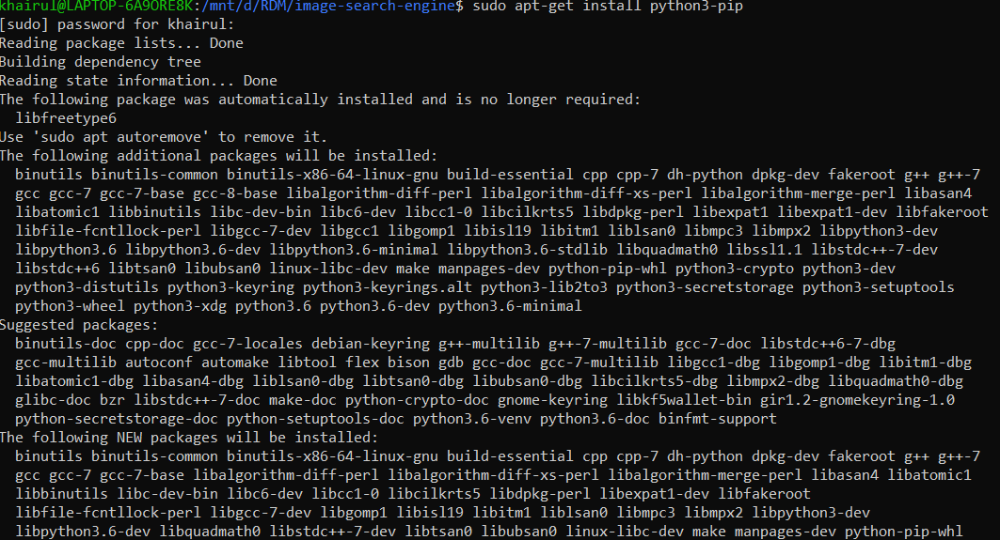
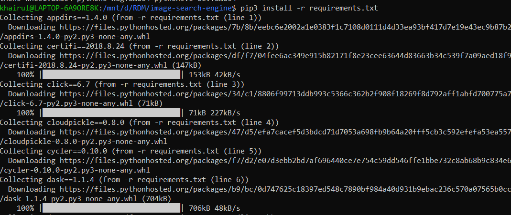
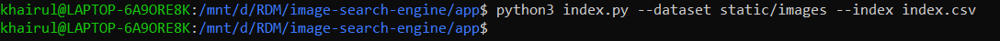
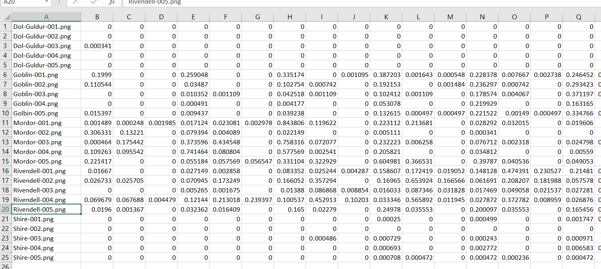
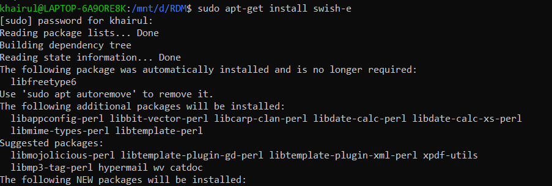
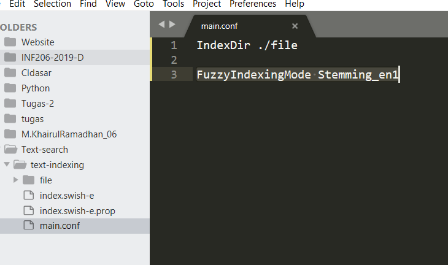
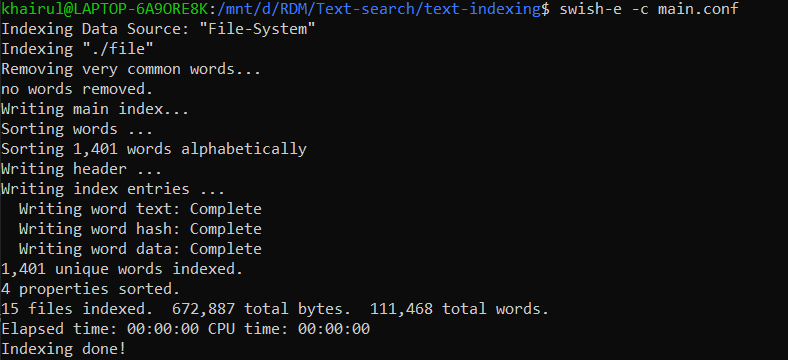
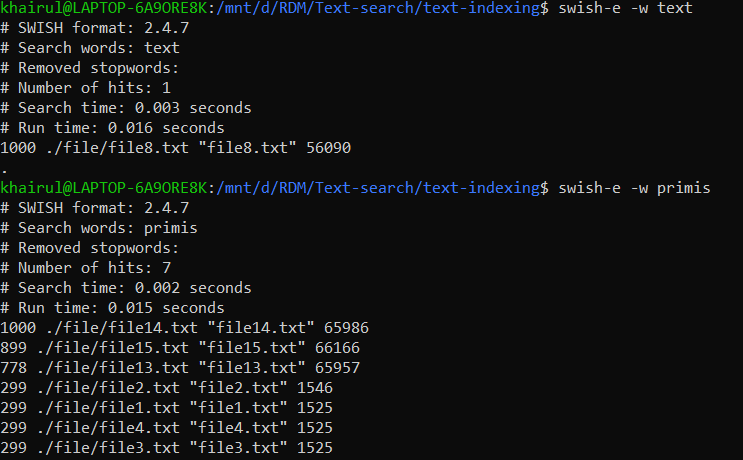

# Projeck_RDM

## Image-search-engine
### 1. Requirements :
```
$ sudo apt install python3-pip
```


### 2. Cara Menjalankan Program :
1. ``` $ cd ./image-search-engine```
2. ``` $ pip install -r requirements.txt```

3. ``` $ cd ./app```
4. ``` $ python index.py --dataset static/images --index index.csv ```

5. Untuk melihat output dapat dari index.cvs

6. gambar dapat di ganti di folder ./static/images


## Text-indexing
### 1. Requirements :
```
$ sudo apt-get install swish-e
```


### 2. Cara Menjalankan Program :
1. buat folder text-indexing 
2. ```$ cd ./text-indexing```
3. buat folder file
4. masukan file yang akan diindex ke dalam folder file
5. buat file main.conf

5. jalankan ```$ swish-e -c main.conf ```


6.lalu jalankan ```$ swish-e -w [word] ```



## Sumber :
* Text-Indexing: Swish-e (Package on Ubuntu)
* Image-Indexing: https://github.com/kudeh/image-search-engine.
